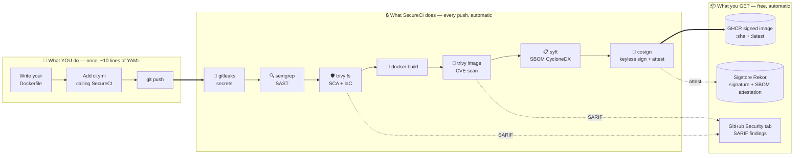

# 🔒 SecureCI

[](https://github.com/Hrushi-d/Secure-CI/actions/workflows/ci.yml)
[](LICENSE)
[](https://github.com/Hrushi-d/Secure-CI/releases)
[](https://github.com/Hrushi-d/Secure-CI#the-stack)

> **Turn any CI pipeline into a DevSecOps pipeline — in 10 lines of YAML**
> A 100% open-source, account-free paved road that takes any container service
> from `git push` to a **signed, SBOM-attested image in GitHub Container Registry**.
> Zero infrastructure to operate. Zero licensing cost.

For solo developers, indie hackers, side projects, startups, OSS maintainers,
and anyone who wants production-grade container security from day one without
buying anything or running any infrastructure.

**👉 In a hurry?** Jump to [QUICKSTART.md](QUICKSTART.md) — 3 steps, 2 minutes.

---

## The stack

| Layer | Tool | Why |
| --- | --- | --- |
| CI | **GitHub Actions** | Free for public repos, OIDC built in |
| Secrets scan | **gitleaks** | OSS standard, fast, low false-positive rate |
| SAST | **semgrep** | Largest OSS rule set, OWASP/CWE coverage |
| SCA + IaC | **trivy fs** | One scanner for deps, Dockerfiles, K8s, Terraform |
| Container scan | **trivy image** | Same engine, no second tool to learn |
| SBOM | **syft** (CycloneDX) | OWASP-backed SBOM format |
| Image signing | **cosign keyless** | Sigstore + GitHub OIDC, no keys to manage |
| Registry | **GHCR** | Free, identity-integrated, OIDC-native |

All free. All open source. No accounts to create.

## How it flows



**Bottom line:** developer writes 1 Dockerfile + 10 lines of YAML. SecureCI handles
8 security gates, signing, SBOM, and publishing — every push, forever.

## What problem this solves

> *"I know I should do SAST / SCA / secrets scanning / image scanning / signing…
> I just don't have time to wire it all up, and I don't want to pay for
> enterprise tools."*

That sentence is true for most developers and small teams. SecureCI
fixes it three ways:

1. **You don't pick tools.** Opinionated OSS picks are made for you
   (gitleaks, semgrep, trivy, syft, cosign).
2. **You don't wire them up.** One reusable workflow does it; you reference it
   in ~10 lines of YAML.
3. **You don't operate infrastructure.** GitHub Actions runs it, GHCR stores it,
   Sigstore signs it. **$0/month**, no servers.

It also gives you something most side projects never get: **supply-chain trust.**
Anyone who pulls your image can run `cosign verify` and prove that *this exact
image was built by your GitHub Actions, from your repo, on your main branch* —
nobody else. Same property Kubernetes, Helm, and distroless ship with.

## Who this helps

| Audience | What they get |
| --- | --- |
| 👤 Solo developers | Enterprise-grade scanning + signing on every side project, day one. |
| 🚀 Startups (pre-Series A) | Real DevSecOps before you can afford a security engineer. Auditors love it. |
| 🎓 Students / learners | A working reference for SBOM, keyless signing, and supply-chain security. |
| 🔧 OSS maintainers | Your published images become *verifiable* — users can prove the binary came from your repo. |
| 📋 Teams piloting DevSecOps | A risk-free way to demo value before buying commercial tools. |

See [docs/PROBLEM.md](docs/PROBLEM.md) for the long version.

New to DevSecOps? [docs/DEVSECOPS-101.md](docs/DEVSECOPS-101.md) explains the 8
security categories, the commercial tools you've heard of, and the free OSS
equivalents SecureCI uses.

## How it works

On every push, the reusable workflow at
[`.github/workflows/secureci.yml`](.github/workflows/secureci.yml) runs
these gates in order. If any one fails, nothing gets published.

| # | Steps | Tool | What it checks |
| - | --- | --- | --- |
| 1 | 🔑 Secrets | gitleaks | No AWS keys, tokens, passwords leaked into git |
| 2 | 🔍 SAST | semgrep | Insecure code patterns (SQLi, XSS, hardcoded creds) |
| 3 | 🛡️ SCA + IaC | trivy fs | Vulnerable dependencies + misconfigured Terraform / K8s |
| 4 | 🐳 Build | docker build | Builds your container image |
| 5 | 🔵 Image scan | trivy image | High/Critical CVEs in the final image |
| 6 | 🚦 Gate Check | GitHub Actions | Aggregates scan results and blocks publish/sign if any required check fails |
| 7 | 📋 SBOM | syft (CycloneDX) | Ingredient list of every library in the image |
| 8 | 📦 Publish | GHCR | Pushes the signed, attested image to `ghcr.io/Hrushi-d/<repo>` |
| 9 | 🔏 Sign | cosign keyless | Signs the image via Sigstore + GitHub OIDC (no keys to manage) |

All findings are uploaded to your repo's **Security tab** as SARIF, so triage
is one click away. You can run the same gates on your laptop with
[scripts/local-scan.sh](scripts/local-scan.sh).

## Repo layout

```
secureci/
├── .github/
│   ├── workflows/
│   │   ├── secureci.yml          # The reusable workflow (the paved road)
│   │   └── ci.yml                # Sample consumer: builds the sample apps
│   └── dependabot.yml            # Auto-bumps actions / deps / base images
├── scripts/
│   └── local-scan.sh             # Run the same gates on your laptop
├── samples/
│   ├── java/                     # Java consumer (multi-stage Dockerfile)
│   └── node/                     # Node consumer
├── docs/
│   ├── PROBLEM.md                # The problem this project solves
│   ├── DEVSECOPS-101.md          # Primer: categories, tools, free alternatives
│   └── verifying-signed-images.md # How users verify your signed images
├── QUICKSTART.md                 # 3-step CI setup
├── CHANGELOG.md
├── SECURITY.md
├── LICENSE
└── README.md
```
## About the Security tab findings

All alerts in the Security tab are CVEs inside npm's own bundled dependencies
within the `node:20-alpine` base image — not in the sample app code. This is intentional.

SecureCI's trivy gate catches vulnerabilities hiding in base images that most
pipelines never scan. Even a "Hello World" Node app has 15 High CVEs lurking in
the base image. That's exactly the problem gate 5 exists to solve.

> If you adopt SecureCI in your own repo, trivy will surface your real base image
> CVEs the same way — so you can make an informed decision to update or accept the risk.

## Quick start — use it in your own repo

Full 3-step walkthrough lives in **👉 [QUICKSTART.md](QUICKSTART.md)**.

In short:

```yaml
# .github/workflows/ci.yml in your repo
jobs:
  secureci:
    uses: Hrushi-d/Secure-CI/.github/workflows/secureci.yml@v1
    with:
      image-name: ghcr.io/${{ github.repository }}
    permissions:
      contents: read
      packages: write
      id-token: write
      security-events: write
```

Commit, push, and watch the **Actions** tab. After a green run you get a
  signed image at `ghcr.io/Hrushi-d/<repo>:<sha>` plus `:latest`, SARIF
findings in the **Security** tab, and a CycloneDX SBOM as a workflow artifact.

## Try it on your laptop (no CI required)

```bash
# 1. Install the tools once
brew install gitleaks semgrep trivy   # macOS
# (Linux: see official installers for each)

# 2. Clone and scan any project folder containing a Dockerfile
git clone https://github.com/Hrushi-d/Secure-CI.git
cd secureci
./scripts/local-scan.sh samples/java
./scripts/local-scan.sh /path/to/your/own/project
```

Reports land in `<app>/.secureci-reports/`.

## Verifying a signed image (for your users)

```bash
cosign verify ghcr.io/Hrushi-d/<repo>:<tag> \
  --certificate-identity-regexp "https://github.com/Hrushi-d/.*" \
  --certificate-oidc-issuer https://token.actions.githubusercontent.com
```

Full instructions in [docs/verifying-signed-images.md](docs/verifying-signed-images.md).

## Extending it — adding or swapping security tools

The 8 default gates are **opinionated, not locked.** The workflow is plain
GitHub Actions YAML, so you can add, replace, or remove any stage. Some common
upgrades:

| You want to add… | Tool | Where it fits |
| --- | --- | --- |
| License compliance | **scancode-toolkit** or **trivy --scanners license** | After SCA |
| Stricter SAST (paid OSS rules) | **semgrep --config p/owasp-top-ten** or **CodeQL** (`.github/codeql-action`) | Replace step 2 |
| Container best-practice linting | **hadolint** (Dockerfile) + **dockle** | Before build |
| Runtime / behavioural scan | **Falco** rules baked into image | Post-build |
| Policy-as-code gating | **OPA / conftest** on K8s manifests | Before publish |
| Stronger secrets coverage | **trufflehog** alongside gitleaks | Step 1 |
| Cluster admission verification | **Kyverno** or **sigstore policy-controller** | On your cluster |
| Provenance (SLSA level 3) | **slsa-github-generator** | Replace/augment cosign step |
| Dependency review on PRs | **actions/dependency-review-action** | New PR-only job |

**How to actually add one** — just edit
[`.github/workflows/secureci.yml`](.github/workflows/secureci.yml) and
drop in a step. Example, adding hadolint:

```yaml
- name: Dockerfile lint (hadolint)
  uses: hadolint/hadolint-action@v3.1.0
  with:
    dockerfile: ${{ inputs.dockerfile }}
    failure-threshold: warning
```

Because the workflow is `workflow_call`-based, every consumer repo
automatically picks up the new gate on the next push — **upgrade the paved
road once, every project benefits.** That's the whole point of the pattern.

Need a tool that isn't here? Open an issue or PR — additions that are
free, OSS, and don't require external accounts are a fit.

## What it is NOT

- Not a replacement for a real security program once you scale.
- Not a substitute for code review or threat modelling.
- Not a way to magically make insecure code secure — it catches the obvious
  classes of issues, fast and consistently.

## Where it fits in your CD pipeline

SecureCI is a **CI-side** tool — it stops at "signed image in GHCR." Whatever you
use to deploy that image picks up from there.

> 💡 **GitOps-friendly.** Plug the signed image into Argo CD / Flux with a Kyverno
> or Sigstore policy that refuses any image not signed by your SecureCI pipeline.
>
> Works with any CD tool too — **Argo CD, Flux, Spinnaker, Helm, Jenkins, GitHub
> Actions deploy jobs, Azure DevOps, Octopus, plain `kubectl apply`** — anything that
> pulls an image can verify the SecureCI signature first.

## License

Apache License 2.0

